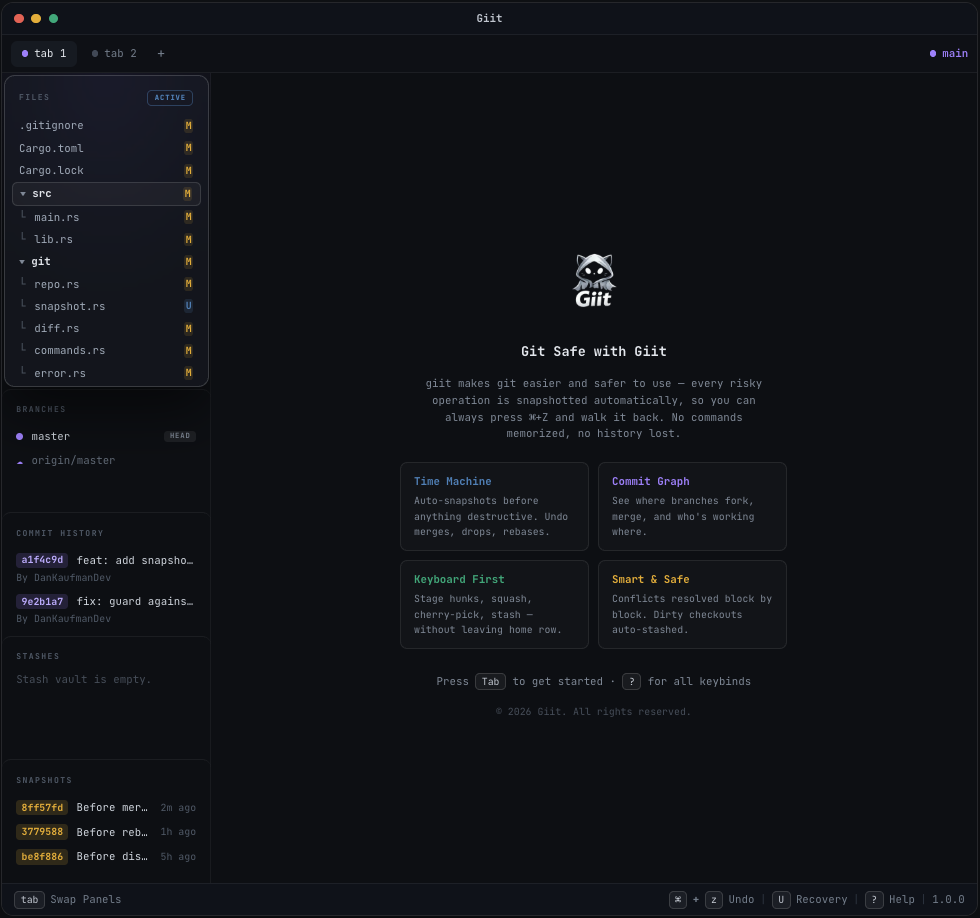

  

# Giit

**Git Safe with Giit**

**A safety-first Git client built around Sandboxing, Recovery, and Undo.**

Giit is a desktop Git client built around a simple idea: Git should feel powerful without making every risky action feel permanent. It brings a keyboard-first interface to everyday repository work, then wraps the dangerous parts in sandboxed previews, local recovery points, and familiar undo.

Most Git clients help you make changes. Giit is designed to help you make changes with a way back. Before operations like merges, rebases, checkouts, discards, stash pops, and history edits touch your working tree, Giit can preserve recovery state and show you what is about to happen.

The result is a Git workflow where speed and safety belong together: inspect first, apply intentionally, and recover quickly when something goes sideways.

  

## Highlights

- **Cmd/Ctrl+Z for Git workflows** so common repository actions can be undone from inside the app instead of reconstructed from memory.
- **Sandboxed previews** for risky operations, giving you a chance to inspect the result before applying it.
- **Recovery timeline** that helps you find your way back after a bad merge, rebase, checkout, stash, discard, or history edit.
- **Snapshot-based restore** for returning a repository to a previous local state without spelunking through reflog commands.
- **Keyboard-first workflow** for moving through files, branches, commits, stashes, and snapshots without slowing down.
- **Visual working tree** with staged, unstaged, and untracked file states.
- **Inline diffs and hunk staging** so you can review and stage changes precisely.
- **Branch overview** with local and remote branches, ahead/behind indicators, and commit graph context.
- **Commit tools** for common history work such as rewording, squashing, dropping, cherry-picking, and tagging.
- **Stash management** with readable previews before applying or dropping entries.
- **Conflict assistance** for resolving merge conflicts from the file view.
- **Configurable keybinds and appearance** for a workflow that feels personal.

## Safety Model

Giit treats destructive Git operations as workflows that deserve preparation, preview, and recovery.

Before risky changes are applied, Giit can preserve a local recovery point. For selected workflows, it can also compute a sandboxed preview first, so you can review what would happen before your working tree is changed.

This makes operations like merges, rebases, cherry-picks, history edits, force checkouts, file discards, stash pops, and timeline restores less stressful. The goal is not to hide Git, but to make its sharp edges visible before you touch them and recoverable after you do.

Giit's safety model is built around three ideas:

- **Sandbox first:** preview risky repository operations before they mutate your working tree.
- **Recover:** keep recovery data on your machine so bad operations do not become detective work.
- **Undo naturally:** make Cmd/Ctrl+Z part of repository work, not just text editing.

## Main Views

**Files**  
Review changed files, inspect diffs, stage or unstage changes, stage individual hunks, discard changes, amend commits, and resolve conflicts.

**Branches**  
Browse local and remote branches, inspect branch position, switch branches, create tracking branches, merge safely, and understand history through a visual commit graph.

**Commits**  
Review recent history, inspect commit diffs, copy commits for cherry-pick workflows, tag commits, and perform common history edits with recovery support.

**Stashes**  
Preview stash contents, including tracked and untracked changes, then apply or remove entries when ready.

**Snapshots**  
Restore previously captured repository states from within Giit.

**Recovery Center**  
Explore a unified timeline of repository activity, inspect recovery points, and preview restore actions before applying them.

## Privacy

Giit is designed to operate on repositories on your machine. Repository state, recovery data, configuration, and workflow history are kept local to your environment.

Network access is used for Git operations you initiate, such as fetch, pull, push, and update checks.

For more detail, see [PRIVACY.md](PRIVACY.md).

## Public Repo

- [Changelog](CHANGELOG.md)
- [Contributing](CONTRIBUTING.md)
- [Security policy](SECURITY.md)
- [Code of conduct](CODE_OF_CONDUCT.md)
- [License](LICENSE)
